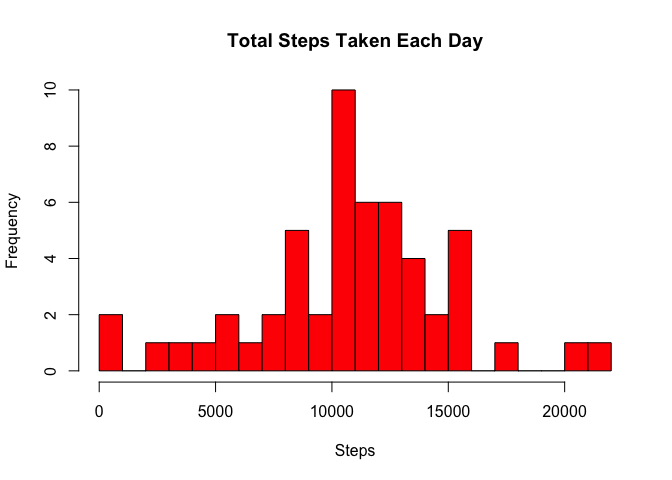
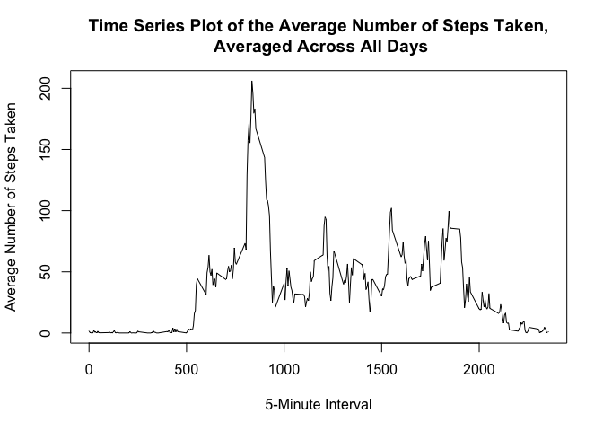
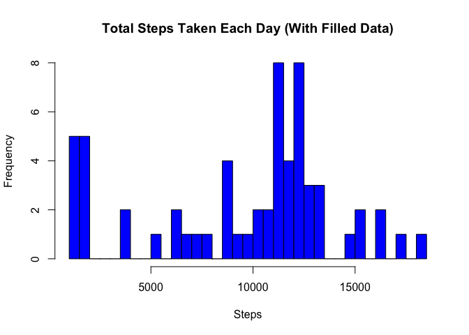
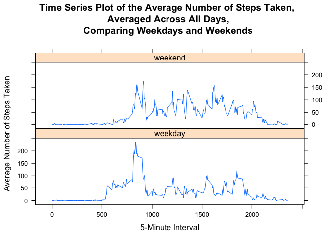

# Reproducible Research: Peer Assessment 1
B. Chadwell  

## 1. Loading and preprocessing the data
### 1.1 Load the data

```r
setwd("~/Coursera/repdata/RepData_PeerAssessment1")
fileUrl <- "https://d396qusza40orc.cloudfront.net/repdata%2Fdata%2Factivity.zip"
zipfileName <-"activity.zip"; datafileName <- "activity.csv"
if(!file.exists(zipfileName)){download.file(fileUrl, destfile = zipfileName, method = "curl")}
if(!file.exists(datafileName)){unz(zipfileName, datafileName)}
dat <- read.csv(datafileName, header = TRUE)
str(dat)
```

```
## 'data.frame':	17568 obs. of  3 variables:
##  $ steps   : int  NA NA NA NA NA NA NA NA NA NA ...
##  $ date    : Factor w/ 61 levels "2012-10-01","2012-10-02",..: 1 1 1 1 1 1 1 1 1 1 ...
##  $ interval: int  0 5 10 15 20 25 30 35 40 45 ...
```

### 1.2 Process/transform the data

```r
# Combine and tranform 'date' and 'interval' variables to a single date/time POSIXlt
temp <- paste(dat$date,formatC(dat$interval, flag="0", width=4))
dat$DateTime <- strptime(temp,"%Y-%m-%d %H%M")
str(dat)
```

```
## 'data.frame':	17568 obs. of  4 variables:
##  $ steps   : int  NA NA NA NA NA NA NA NA NA NA ...
##  $ date    : Factor w/ 61 levels "2012-10-01","2012-10-02",..: 1 1 1 1 1 1 1 1 1 1 ...
##  $ interval: int  0 5 10 15 20 25 30 35 40 45 ...
##  $ DateTime: POSIXlt, format: "2012-10-01 00:00:00" "2012-10-01 00:05:00" ...
```

## 2. What is mean total number of steps taken per day?
For this part of the assignment, ignore missing values in the dataset.

### 2.1. Calculate the total number of steps taken per day

```r
stepsbydate <- aggregate(steps ~ date, dat, sum, na.action = na.omit)
head(stepsbydate,5)
```

```
##         date steps
## 1 2012-10-02   126
## 2 2012-10-03 11352
## 3 2012-10-04 12116
## 4 2012-10-05 13294
## 5 2012-10-06 15420
```

### 2.2. Make a histogram of the total number of steps taken each day

```r
hist(stepsbydate$steps, breaks = 30,
     main = "Total Steps Taken Each Day",
     xlab = "Steps", col = "red")
```

 

### 2.3 Calculate and report the mean and median total number of steps taken per day

```r
stepsbydate.mean <- mean(stepsbydate$steps)
stepsbydate.median <- median(stepsbydate$steps)
```

## 3. What is the average daily activity pattern?
### 3.1. Make a time series plot (i.e. type = "l") of the 5-minute interval (x-axis) and the average number of steps taken, averaged across all days (y-axis)

```r
# Calculate step average versus 5-minute interval
stepsbyinterval <- aggregate(steps ~ interval, dat, mean, na.action = na.omit)
# Line (x-y) plot
plot(
        x = stepsbyinterval$interval,
        y = stepsbyinterval$steps,
        type = "l",
        main = "Time Series Plot of the Average Number of Steps Taken,\n Averaged Across All Days",
        xlab = "5-Minute Interval",
        ylab = "Average Number of Steps Taken"
)
```

 

### 3.2. Which 5-minute interval, on average across all the days in the dataset, contains the maximum number of steps?

```r
maxinterval <- stepsbyinterval[stepsbyinterval$steps==max(stepsbyinterval$steps),
                               "interval"]
maxsteps <- stepsbyinterval[stepsbyinterval$steps==max(stepsbyinterval$steps),"steps"]
paste("Maximum number of steps (averaged across days) of ", round(maxsteps,digits=2), 
      " occurs in 5-minute interval ", maxinterval)
```

```
## [1] "Maximum number of steps (averaged across days) of  206.17  occurs in 5-minute interval  835"
```

## 4. Imputing missing values
Note that there are a number of days/intervals where there are missing values (coded as NA). The presence of missing days may introduce bias into some calculations or summaries of the data.

### 4.1. Calculate and report the total number of missing values in the dataset (i.e. the total number of rows with NAs)

```r
sum(is.na(dat$steps))
```

```
## [1] 2304
```

### 4.2. Devise a strategy for filling in all of the missing values in the dataset. 
The (unsophisticated) strategy employed is to use the mean (average across all days) for that 5-minute interval, converted to an integer (using as.integer, which rounds toward zero). This should work well for isolated missing values, but may mask patterns of missing days and/or day-to-day variations in steps taken.

### 4.3. Create a new dataset that is equal to the original dataset but with the missing data filled in.

```r
narows <- is.na(dat$steps) #logical vector of missing data rows
# merge dataset with step by interval average
merged <- merge(dat, stepsbyinterval, by = "interval", suffixes = c("",".avg"))
# for NA rows, fill steps with corresponding interval average steps
merged[narows,"steps"] <- as.integer(merged[narows,"steps.avg"])
dat2 <- merged[,names(dat)] #create dataset with same variables as original
str(dat2)
```

```
## 'data.frame':	17568 obs. of  4 variables:
##  $ steps   : int  1 1 1 1 1 1 1 1 1 1 ...
##  $ date    : Factor w/ 61 levels "2012-10-01","2012-10-02",..: 1 54 28 37 55 46 20 47 38 56 ...
##  $ interval: int  0 0 0 0 0 0 0 0 0 0 ...
##  $ DateTime: POSIXlt, format: "2012-10-01 00:00:00" "2012-11-23 00:00:00" ...
```

### 4.4  Assess impact of filling missing data using above strategy
#### 4.4.1. Make a histogram of the total number of steps taken each day

```r
# same code as 2 above, but using filled data set 'dat2'
stepsbydate2 <- aggregate(steps ~ date, dat2, sum, na.action = na.omit)
hist(stepsbydate2$steps, breaks = 30,
     main = "Total Steps Taken Each Day (With Filled Data)",
     xlab = "Steps", col = "blue")
```

 

#### 4.4.2. Calculate and report the mean and median total number of steps taken per day. 

```r
stepsbydate2.mean <- mean(stepsbydate2$steps)
stepsbydate2.median <- median(stepsbydate2$steps)
diff.mean <- stepsbydate2.mean - stepsbydate.mean
diff.median <- stepsbydate2.median - stepsbydate.median
paste("Filled data mean is ", round(stepsbydate2.mean,2), 
      ", which differs from original mean by ", round(diff.mean,2))
```

```
## [1] "Filled data mean is  9546.11 , which differs from original mean by  -1220.07"
```

```r
paste("Filled data median is ", round(stepsbydate2.median,2), 
      ", which differs from original median by ", round(diff.median,2))
```

```
## [1] "Filled data median is  11198 , which differs from original median by  433"
```

The mean decreased quite a bit, while the median increased only slightly. Refinement of the strategy to fill missing data should be considered.

## 5. Are there differences in activity patterns between weekdays and weekends?
Using the dataset with the filled-in missing values, differences between weekdays and weekends were explored.

### 5.1. Create a new factor variable in the dataset with two levels -- "weekday" and "weekend" indicating whether a given date is a weekday or weekend day.

```r
dat3 <- dat2 #copy dataset with filled-in missing values
dayofweek <- weekdays(dat3$DateTime) #vector index of dataset's day of week
weekends <- dayofweek == "Saturday"| dayofweek == "Sunday" #logical vector
dat3$daytype <- "weekday" # set all rows to weekday
dat3$daytype[weekends] <- "weekend" # set weekend rows to weekend
dat3$daytype <- as.factor(dat3$daytype)
str(dat3)
```

```
## 'data.frame':	17568 obs. of  5 variables:
##  $ steps   : int  1 1 1 1 1 1 1 1 1 1 ...
##  $ date    : Factor w/ 61 levels "2012-10-01","2012-10-02",..: 1 54 28 37 55 46 20 47 38 56 ...
##  $ interval: int  0 0 0 0 0 0 0 0 0 0 ...
##  $ DateTime: POSIXlt, format: "2012-10-01 00:00:00" "2012-11-23 00:00:00" ...
##  $ daytype : Factor w/ 2 levels "weekday","weekend": 1 1 2 1 2 1 2 1 1 2 ...
```

### 5.2. Make a panel plot containing a time series plot (i.e. type = "l") of the 5-minute interval (x-axis) and the average number of steps taken, averaged across all weekday days or weekend days (y-axis). 

```r
# Modified code from part 3 above
# Calculate step average versus 5-minute interval AND daytype
stepsbyinterval3 <- aggregate(steps ~ interval + daytype, dat3, mean, 
                              na.action = na.omit)
# Plot
library(lattice)
xyplot(steps ~ interval | daytype, stepsbyinterval3,
       layout = c(1, 2), type = "l",
       main = "Time Series Plot of the Average Number of Steps Taken,\n Averaged Across All Days,\n Comparing Weekdays and Weekends",
       xlab = "5-Minute Interval",
       ylab = "Average Number of Steps Taken"
)
```

 

Weekend steps appear to ramp up slightly later in the morning than weekday steps (sleeping in?) with somewhat higher step averages throughout the day (more outdoor activity?). Further analysis could examine these possibilities.
